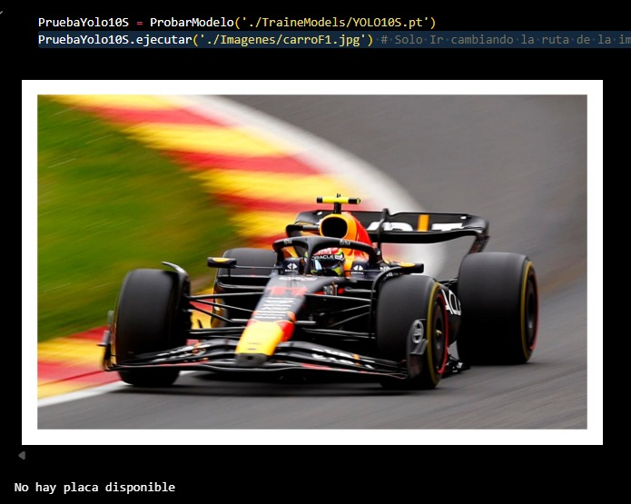
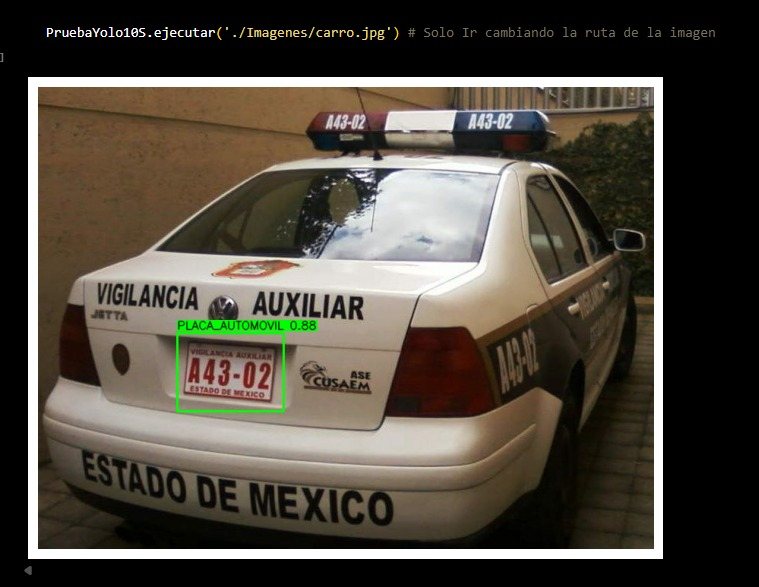
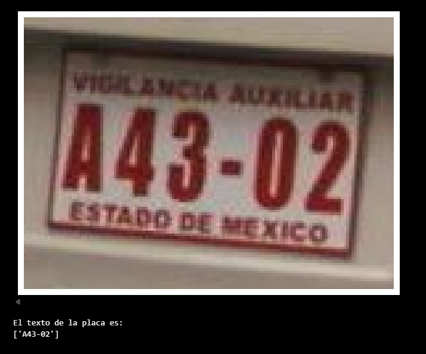

# Detección de placas vehiculares en imágenes.
---

### 📖 Descripción

Este trabajo aborda la detección automática de placas vehiculares en imágenes mediante tres variantes de la familia YOLO (**YOLOv11-n**, **YOLOv11-s** y **YOLOv10-s**), seleccionadas por su bajo costo computacional y reducido número de parámetros. 

Las configuraciones finales se eligieron por validación cruzada optimizando *mAP@0.5* y, posteriormente, se entrenó cada modelo durante 10 épocas. La evaluación se realizó sobre el conjunto de prueba con un análisis de *bootstrap* de 1,000 réplicas para estimar la mediana e intervalos de confianza al 95% de las métricas. 

En particular:  
- **YOLOv11-n** alcanzó *mAP@0.5* = 0.9910 (IC 95% [0.9856, 0.9942]) y *mAP@0.5:0.95* = 0.7081 (IC 95% [0.6956, 0.7205]).  
- **YOLOv11-s** obtuvo *mAP@0.5* = 0.9880 (IC 95% [0.9807, 0.9937]) y *mAP@0.5:0.95* = 0.7220 (IC 95% [0.7083, 0.7343]).  
- **YOLOv10-s** registró *mAP@0.5* = 0.9875 (IC 95% [0.9825, 0.9926]) y *mAP@0.5:0.95* = 0.7150 (IC 95% [0.7022, 0.7269]).  

En términos de eficiencia, las medianas de latencia de inferencia fueron **1.93 ms** (YOLOv11-n), **3.37 ms** (YOLOv11-s) y **5.26 ms** (YOLOv10-s), con latencias totales inferiores a **10 ms** por imagen en todos los casos. 

Estos resultados, consistentes con la evaluación directa sobre el conjunto de prueba original, evidencian que las variantes “nano” y “small” de YOLOv10/11 ofrecen un equilibrio sobresaliente entre precisión y velocidad para sistemas de reconocimiento de placas en tiempo real; en particular, **YOLOv11-n** representa el mejor compromiso precisión–eficiencia, mientras que **YOLOv11-s** maximiza la calidad de localización medida por *mAP@0.5:0.95*.


### 📂 Estructura del Repositorio


Computer_Vision-Deteccion-de-placas-/
├── 📂 Data/             # Base de datos utilizada
├── 📂 Imagenes/         # Imágenes de Google para probar los modelos entrenados
├── 📂 Models/           # Modelos YOLO utilizados
├── 📂 Notebooks/        # Notebooks empleados para ejecutar el entrenamiento
├── 📂 runs/             # Resultados y modelos generados durante la ejecución
├── 📂 TrainedModels/    # Modelos ya entrenados (pesos y arquitecturas)
│    ├── 📄 main.ipynb          # Notebook que integra todos los notebooks
│    ├── 📄 PruebaModelo.ipynb  # Notebook para probar e interactuar con el modelo entrenado
│    └── 📄 README.md


### 📊 Dataset

Los datos para este proyecto fueron extraídos de:  
**<https://universe.roboflow.com/roboflow-universe-projects/license-plate-recognition-rxg4e/dataset/4>**  
(en el formato para **YOLOv11**).

Este *dataset* está dividido en:

├── 📂 test/      # Contiene 1,019 imágenes
│    ├── 📂 images/
│    └── 📂 labels/
├── 📂 train/     # Contiene 21,173 imágenes
│    ├── 📂 images/
│    └── 📂 labels/
├── 📂 valid/     # Contiene 2,046 imágenes
│    ├── 📂 images/
│    └── 📂 labels/
├── 📄 data.yaml

### 🧠 Modelo de *Machine Learning*

Instalar los siguientes modelos (ver documentación en: <https://docs.ultralytics.com/es/models/>):

- `yolov10s.pt`
- `yolo11s.pt`
- `YOLO11N.pt`


### ⚙️ Instalación y Requisitos

Para poder ejecutar estos notebooks, se recomienda crear el siguiente entorno en **conda**:

```
conda create -n yolov8_env python=3.10 -y
conda activate yolov8_env

# En caso de tener GPU
pip install torch torchvision torchaudio --index-url https://download.pytorch.org/whl/cu121

# En caso de solo tener CPU
pip install torch torchvision torchaudio

# Otras dependencias
pip install ultralytics
pip install pandas scikit-learn opencv-python-headless pyyaml matplotlib
pip install "numpy>=1.24,<2.0"
pip install pyarrow --no-build-isolation
pip install transformers

```

### 🚀 Uso

Se puede interactuar con el modelo en el archivo **📄 PruebaModelo.ipynb**.  
A continuación, se muestran imágenes de ejemplo de la ejecución:

- **Caso 1:** Vehículo sin placa en la imagen de prueba.  


- **Caso 2:** Vehículo con placa en la imagen de prueba.




### 👥 Autores
- José de Jesús Falcón Vázquez
	- **Correo:** pepefv97@gmail.com
-   Fernando Alvarado Palacios
	- **Correo:** f3rnando.elmer@gmail.com
- Bryant Canseco Hernández
	- **Correo:** bryantcanseco@ciencias.unam.mx
- Diego Gómez Santiago
	- **Correo:** diegoantoniogs97@gmail.com
- Francisco Javier Olivares Hernández
	- **Correo:** fjoh378@ciencias.unam.mx
- Claudia Lara Pérez Soto
	- **Correo:** clps23@ciencias.unam.mx


### 📚 Referencias

- Zou, Z., Chen, K., Shi, Z., Guo, Y., & Ye, J. (2023). *Object Detection in 20 Years: A Survey*. *Proceedings of the IEEE, 111*(3), 257–276.

-  Everingham, M., Van Gool, L., Williams, C. K., Winn, J., & Zisserman, A. (2010). *The Pascal Visual Object Classes (VOC) Challenge*. *International Journal of Computer Vision, 88*(2), 303–338.

-  Lin, T.-Y., Maire, M., Belongie, S., Hays, J., Perona, P., Ramanan, D., Dollár, P., & Zitnick, C. L. (2014). *Microsoft COCO: Common Objects in Context*. In *Proceedings of ECCV* (pp. 740–755).

-  Girshick, R., Donahue, J., Darrell, T., & Malik, J. (2014). *Rich feature hierarchies for accurate object detection and semantic segmentation*. In *Proceedings of CVPR* (pp. 580–587).

-  Ren, S., He, K., Girshick, R., & Sun, J. (2015). *Faster R-CNN: Towards real-time object detection with region proposal networks*. In *Advances in Neural Information Processing Systems (NIPS)* (pp. 91–99).

-  Redmon, J., Divvala, S., Girshick, R., & Farhadi, A. (2016). *You Only Look Once: Unified, Real-Time Object Detection*. In *Proceedings of CVPR* (pp. 779–788).

-  Liu, W., Anguelov, D., Erhan, D., Szegedy, C., Reed, S., Fu, C.-Y., & Berg, A. C. (2016). *SSD: Single Shot Multibox Detector*. In *Proceedings of ECCV* (pp. 21–37).

-  Redmon, J., & Farhadi, A. (2018). *YOLOv3: An Incremental Improvement*. arXiv:1804.02767.

- . Bochkovskiy, A., Wang, C.-Y., & Liao, H.-Y. M. (2020). *YOLOv4: Optimal Speed and Accuracy of Object Detection*. arXiv:2004.10934.

-  Wang, C.-Y., Bochkovskiy, A., & Liao, H.-Y. M. (2022). *YOLOv7: Trainable bag-of-freebies sets new state-of-the-art for real-time object detectors*. arXiv:2207.02696.

-  Carion, N., Massa, F., Synnaeve, G., Usunier, N., Kirillov, A., & Zagoruyko, S. (2020). *End-to-End Object Detection with Transformers*. In *Proceedings of ECCV* (pp. 213–229).

-  Zhao, Y., Lv, W., Xu, S., Wei, J., Wang, G., Dang, Q., Liu, Y., *et al.* (2023). *DETRs Beat YOLOs on Real-Time Object Detection*. arXiv:2304.08069.

-  Khanam, R., & Hussain, M. (2024). *YOLOv11: An Overview of the Key Architectural Enhancements*. arXiv:2410.17725.

-  Loshchilov, I., & Hutter, F. (2019). *Decoupled weight decay regularization*. In *International Conference on Learning Representations (ICLR)*.

-  Wang, A., Chen, H., Liu, L., Chen, K., Lin, Z., Han, J., & Ding, G. (2024). *YOLOv10: Real-Time End-to-End Object Detection*. arXiv:2405.14458.
